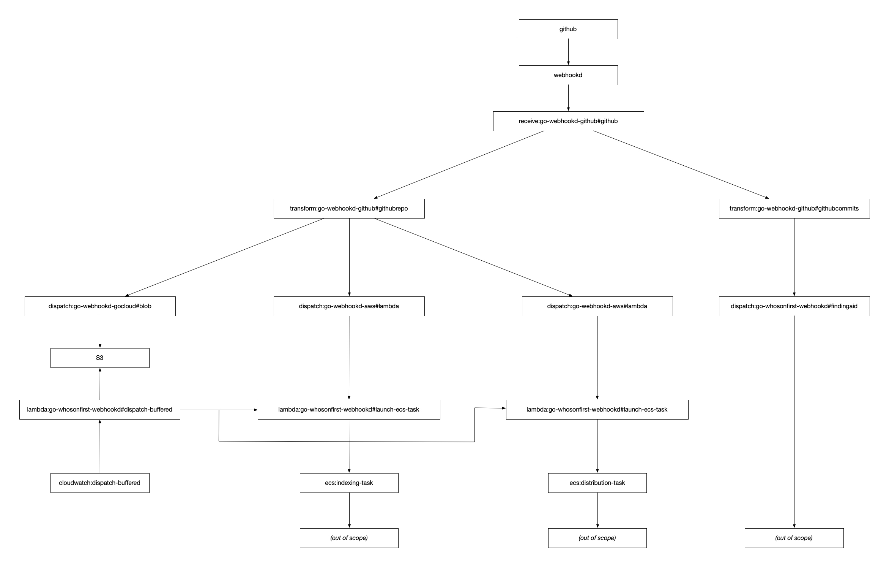

# go-whosonfirst-webhookd

A Who's On First specific instance of go-webhookd, along with related tools.

## Important

Documentation is incomplete.

For now, take a look at the `debug` and `debug-*` targets in the [Makefile](Makefile) as well as the [example config file](docs/config/config.json.example).

## Dispatchers

### FindingAidRepo

FindingAidRepoDispatcher implements the `webhookd.WebHookDispatcher` interface and takes as input a []byte containing CSV-encoded rows produced by the `go-webhookd-github.GitHubCommitsTransformation` package and creates a corresponding `go-whosonfirst-findingaid/repo.FindingAidResponse` record for each row.

```
findingaid-repo://?cache=s3blob%3A%2F%2F{BUCKET}%3Fregion%3D{REGION}%26prefix%3D{PREFIX}%2F%26credentials%3Diam:&acl=public-read"
```

## Tools

### dispatch-buffered

```
> ./bin/dispatch-buffered -h
Usage of ./bin/dispatch-buffered:
  -bucket-uri string
    	...
  -dryrun
    	Go through the motions but don't invoke any tasks
  -lambda-uri value
    	...
  -mode string
    	... (default "cli")
```

The `dispatch-buffered` tool is meant to be used in conjunction with the `go-webhookd-github#repo` transformation and the `go-webhookd-gocloud#blob` dispatcher which will cause the body of the transformation (a WOF repo name) to be stored in an S3 bucket. The `dispatch-buffered`	tool will iterate over the files in the S3 bucket and invoke one or more Lambda functions with the body of each file (a WOF repo name).

This tool was written to account for (WOF) repos that receive a large number of atomic updates in a short amount of time (for example [sfomuseum-data/sfomuseum-data-media-collection](#)) and that trigger an unnecessarily large number of ECS tasks to be invoked (see "How it all fits together" below). The idea is that this tool can be run on a scheduler (CloudWatch, cron, whatever) and only process repos periodically.

```
#> ./bin/dispatch-buffered \
	-bucket-uri 's3blob://{BUCKET}/?region={REGION}&prefix={PREFIX}/&credentials=session' \
	-lambda-uri 'lambda://{LAMBDA}?dsn=region=us-west-2 credentials=session'
```

_Note: The {LAMBDA} function can be anything you want but in this example is assumed to be `cmd/launch-ecs-task`._

### launch-ecs-task

```
> ./bin/launch-ecs-task -h
  -command string
    	...
  -ecs-cluster string
    	The name of your AWS ECS cluster.
  -ecs-container string
    	The name of your AWS ECS container.
  -ecs-dsn string
    	A valid (go-whosonfirst-aws) ECS DSN.
  -ecs-launch-type string
    	... (default "FARGATE")
  -ecs-public-ip string
    	... (default "ENABLED")
  -ecs-security-group value
    	One of more AWS security groups your task will assume.
  -ecs-subnet value
    	One or more AWS subnets in which your task will run.
  -ecs-task string
    	The name of your AWS ECS task (inclusive of its version number),
  -mode string
    	... (default "cli")
```

## How it all fits together



## See also

* https://github.com/whosonfirst/go-webhookd
* https://github.com/whosonfirst/go-webhookd-aws
* https://github.com/whosonfirst/go-webhookd-github
* https://github.com/whosonfirst/go-webhookd-gocloud